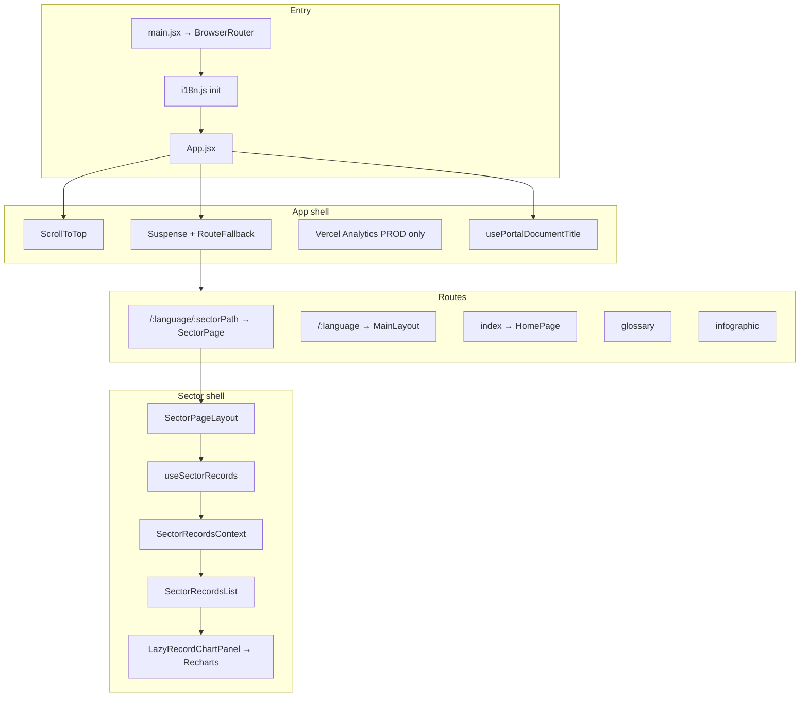

# Architecture & reuse guide

This document describes how the **Disability Statistics Portal** is built so you (or an AI assistant) can **clone patterns** into new React SPAs: bilingual routing, API-driven lists, lazy charts, sector navigation, CI, and UX decisions that already proved stable here.

**Reference repo:** [disability-statistics-portal](https://github.com/saba-bar95/disability-statistics-portal)  
**Live:** [disability-statistics-portal.vercel.app](https://disability-statistics-portal.vercel.app/)

---

## 1. What kind of app this is

| Aspect  | Choice                                                     |
| ------- | ---------------------------------------------------------- |
| Type    | Client-side **SPA** (no Next.js / no SSR)                  |
| UI      | **React 19** + **React DOM**                               |
| Build   | **Vite 8**                                                 |
| Routing | **React Router v7** (`useRoutes` + route config object)    |
| Styling | **Tailwind CSS v4** via `@tailwindcss/vite`                |
| Data    | REST **fetch** to Geostat disability API                   |
| i18n    | **i18next** + **react-i18next**, URL prefix `/ka` \| `/en` |
| Charts  | **Recharts** in a **lazy-loaded** chunk                    |
| Deploy  | **Vercel** static `dist/` + SPA fallback                   |

---

## 2. High-level flow



---

## 3. Repository layout

```text
src/
├── App.jsx                 # Routes, Suspense, ScrollToTop, analytics gate
├── main.jsx                # Router + StrictMode
├── i18n.js                 # All KA/EN strings (single resources object)
├── index.css               # Tailwind import, fonts, dark variant, PDF modal fix
│
├── routes/
│   ├── AppRoutes.jsx       # Route table (order matters)
│   └── lazyPages.js        # React.lazy() page imports
│
├── pages/                  # Route targets (thin: params → layout)
├── layouts/
│   ├── MainLayout.jsx      # Home: slider, header, outlet, footer
│   └── SectorPageLayout.jsx # Sector: header, hero, cards, records, footer
│
├── components/             # UI; heavy features in subfolders
│   └── RecordChartPanel/   # Chart split: plot, legend, hooks, constants
│
├── hooks/                  # Data + UI behavior (records, glossary, TTS, prefs)
├── context/                # Thin context wrappers (sector records)
├── services/               # API clients + pure helpers (merge, chart max)
├── constants/              # Maps: routes, sector IDs, chart titles/units, URLs
├── utils/                  # Pure functions (colors, theme, glossary parse)
└── test/
    └── setup.js            # Vitest + jest-dom
```

**Convention:** Pages stay thin; layouts own shell + providers; `constants/` hold ID→i18n key maps; `services/` own HTTP and testable pure functions.

---

## 4. Routing

### 4.1 URL model

| Pattern     | Example                           | Component                         |
| ----------- | --------------------------------- | --------------------------------- |
| Redirect    | `/` → `/ka`                       | `Navigate`                        |
| Sector      | `/ka/education`, `/en/healthcare` | `SectorPage` → `SectorPageLayout` |
| Home        | `/ka`, `/en`                      | `MainLayout` → `HomePage`         |
| Glossary    | `/ka/glossary`                    | `GlossaryPage`                    |
| Infographic | `/ka/infographic`                 | `InfographicPage`                 |

**Language** is always the first segment: `ka` or `en`.  
`document.documentElement` gets `data-lang` and `lang` from layout effects + `usePortalDocumentTitle`.

### 4.2 Why one sector route (`/:language/:sectorPath`)

Sector cards link to `/ka/healthcare`, `/ka/education`, etc. Using **one** route param:

```js
{ path: "/:language/:sectorPath", element: <SectorPage /> }
```

keeps **`SectorPageLayout` mounted** when switching SECTION_CARDS. The layout does not remount; only `sector` prop and data change.

`SectorPage` validates `sectorPath` via `getSectorFromPathSegment()`; unknown segments (e.g. `glossary` if mis-ordered) redirect to home.

**Route order in `AppRoutes.jsx`:**

1. `/` redirect
2. `/:language/:sectorPath` (sector)
3. `/:language` + children (home, glossary, infographic)
4. `*` → `/ka`

Sector route **must** be registered **before** `/:language` so `glossary` is not captured as `sectorPath`.

### 4.3 Lazy-loaded pages

```js
// routes/lazyPages.js
export const HomePage = lazy(() => import("../pages/HomePage"));
// ...
```

`App.jsx` wraps `useRoutes()` output in `<Suspense fallback={<RouteFallback />}>`.

**Charts** are a second lazy boundary:

```js
// LazyRecordChartPanel.jsx
lazy(() => import("./RecordChartPanel/index.jsx"));
```

Used inside `SectorRecordsList` with `<Suspense fallback={<ChartLoadingFallback />}>` so Recharts (~400 KB) loads only when a chart is opened.

### 4.4 Scroll behavior (`ScrollToTop.jsx`)

| Navigation                                   | Scroll                            |
| -------------------------------------------- | --------------------------------- |
| Sector → sector                              | **No scroll** (preserve position) |
| Language only (`/ka/x` ↔ `/en/x`, same path) | **No scroll**                     |
| Home hash (`#legislation`)                   | Smooth scroll to `#id`            |
| Other route changes                          | Smooth scroll to top              |

Uses `isSectorPathname()` from `sectorRoutes.js`.

**Do not** add `scrollIntoView` on sector card strip when switching sectors — it fights `ScrollToTop` and causes **header hide/show flash** (sticky header listens to scroll delta).

---

## 5. Internationalization (i18n)

### 5.1 Setup (`src/i18n.js`)

- Single `resources` object: `ka.translation`, `en.translation`.
- `fallbackLng: "ka"`.
- `LanguageDetector` with `order: ["path", "navigator"]` so URL wins.
- All user-visible strings go through `t("key")` — avoid hardcoding KA/EN in components except where API returns locale-specific fields (`title_geo` / `title_eng`).

### 5.2 Key naming patterns

| Prefix                          | Use                               |
| ------------------------------- | --------------------------------- |
| `sectorRecords*`                | Loading, errors, summary, filters |
| `sectorSubcat_{sector}_{id}`    | Subcategory labels                |
| `sectorRecordsTitle*`           | Sector page H2                    |
| `{sector}ChartTitle_{recordId}` | Chart title overrides             |
| `chartUnit_*`                   | Y-axis / title units              |
| `glossary*`                     | Glossary states                   |
| `routeLoading` / `chartLoading` | Suspense fallbacks                |
| `footer*` / `legislationItems`  | Footer & legislation arrays       |

### 5.3 API vs i18n

- **Titles on records:** `getRecordTitle(record, lang)` in `recordsApi.js`.
- **Chart display title:** `getRecordChartDisplayTitle(record, sector, lang, t)` in `sectorChartUnits.js` merges API title + i18n override + unit in parentheses.

---

## 6. Data layer

### 6.1 API (`src/services/recordsApi.js`)

| Function                                                        | Purpose                             |
| --------------------------------------------------------------- | ----------------------------------- |
| `fetchRecordsByCategory(categoryId, lang)`                      | Discover subcategories for a sector |
| `fetchRecordsByCategoryAndSubCategory(categoryId, subId, lang)` | Records for one subcategory         |
| `mergeRecordsById(groups)`                                      | Dedupe by `record.ID`               |
| `getUniqueSubCategoryIds(records)`                              | Sorted unique `sub_category`        |
| `normalizeRecordChartData` / `getRecordChartData`               | Chart rows for Recharts             |
| `getChartYAxisMax` / `getChartDataMax`                          | Axis domain                         |
| `downloadRecordFile`                                            | Trigger file download               |

**Env:** `VITE_API_BASE_URL` (see `.env.example`). Default: Geostat production API.

**CORS:** Browser `fetch` from your deploy origin must be allowed by the API. Opening the API URL in a tab is not the same as in-app fetch.

### 6.2 Sector category map (`sectorCategories.js`)

```js
SECTOR_CATEGORY_ID = {
  healthcare: 1,
  "social-security": 2,
  education: 3,
  sport: 4,
};
```

URL segment `sports` maps to sector key `sport` (`sectorRoutes.js`).

### 6.3 `useSectorRecords` (core list behavior)

**Responsibilities:**

1. On mount / category+language change: fetch category → discover subcategory IDs → select all by default.
2. Cache each subcategory’s records in `cacheBySubCategory`.
3. When user toggles filters: fetch only **missing** subcategory keys (no full list flash).
4. Expose merged `records`, `isLoading`, `isFetchingRecords`, `toggleSubCategory`, etc.

**Scope reset:** When `categoryId` or `language` changes, reset state via `scopeKey` (compare and reset in render — works but fragile; prefer `useEffect` + key on provider in greenfield apps).

**Context:** `SectorPageLayout` calls the hook once and provides value via `SectorRecordsContext` so `SectorRecordsList` does not refetch.

### 6.4 Glossary (`useGlossary.js` + `glossaryApi.js`)

Separate hook: alphabet letters + entries per letter. Loading/error copy uses `glossaryLoading`, `glossaryLoadError` (not `…` placeholder).

---

## 7. Sector page UI

### 7.1 Layout stack (`SectorPageLayout.jsx`)

1. `SiteHeader` (sticky, hide on scroll down)
2. `SectorBackground` (static hero image + infographic link)
3. `SectorMainStatistics` (SECTION_CARDS nav overlapping hero)
4. `SectorRecordsList` (filters, list, charts)
5. `Footer`

### 7.2 SECTION_CARDS (`sectionCards.js` + `SectorMainStatistics.jsx`)

- Four links to sector paths; active state from `pathname === /${language}${card.to}`.
- Per-sector active colors in `ACTIVE_LINK_CLASS_BY_ID`.
- **No** `descriptionKey` in cards — titles only via `titleKey` → i18n (`sliderHealthAbout`, etc.).

### 7.3 Records list (`SectorRecordsList.jsx`)

- Subcategory filter grid with images from `sectorSubcategoryUi.js`.
- Expandable row actions: chart toggle, Excel download (`recordActionUi.js` classes).
- `RecordChartCollapsible`: height/opacity animation; keeps chart mounted briefly on close.
- **Subtle transition when switching sectors:** `opacity-75` while `isFetchingRecords && records.length > 0` — not full-page fade.

### 7.4 Sector navigation UX (important)

| Do                                        | Don’t                                           |
| ----------------------------------------- | ----------------------------------------------- |
| Keep scroll position between sector cards | Scroll to top on every sector change            |
| Single `/:language/:sectorPath` route     | Four separate route entries that remount layout |
| Light opacity on records while refetching | Full-screen fade out/in                         |
| `transition-colors` on cards / hero text  | `scrollIntoView` on card strip after navigation |

---

## 8. Charts (`RecordChartPanel/`)

### 8.1 Module split

| File                      | Role                                                |
| ------------------------- | --------------------------------------------------- |
| `index.jsx`               | Composes header, plot, legend; bar/line toggle      |
| `useRecordChartState.js`  | Series keys, visibility, chart type, bar size       |
| `useRecordChartLayout.js` | Responsive height, tick font size                   |
| `RecordChartPlot.jsx`     | Recharts `BarChart` / `LineChart`                   |
| `RecordChartLegend.jsx`   | Toggle series; EN vs KA legend spacing              |
| `chartSeriesColors.js`    | Male/female/social-security palette                 |
| `chartTheme.js`           | `computeScaledBarSize`, dark/light axis colors      |
| `sectorChartUnits.js`     | Per record ID: title key, unit key, bar width ratio |

### 8.2 Customization by record ID

Maps in `sectorChartUnits.js` and `chartSeriesColors.js` keyed by `(sector, record.ID)` — healthcare 4–8, education 111/126, social-security 82–86/90, sport 127, etc.

When adding a chart override:

1. Add i18n keys `chartUnit_*` / `{sector}ChartTitle_{id}` in **both** `ka` and `en`.
2. Add entries to `SECTOR_RECORD_CHART_*_KEYS` objects.
3. Optionally `SECTOR_RECORD_CHART_BAR_WIDTH_RATIO` (e.g. `0.8` for narrower bars).
4. Add tests in `chartSeriesColors.test.js` / `recordsApi.chart.test.js` if logic is non-trivial.

### 8.3 Y-axis

`getChartYAxisMax(dataMax)` rounds up with ~5% headroom using “nice” steps — test expected values (e.g. 15036 → 20000) in `recordsApi.chart.test.js`.

---

## 9. Home layout (`MainLayout.jsx`)

- `BackgroundSlider` only on home (`isHome`).
- `LinkSlider` for partner logos (`import.meta.glob` on `assets/images/links/{ka,en}/*`).
- `Outlet` for `HomePage` (statistics grid + legislation).
- Same `SiteHeader` / `Footer` as sector pages.

---

## 10. Header & global UX

### 10.1 `SiteHeader.jsx`

- Sticky; hides on scroll **down**, shows on scroll **up** (threshold ~4px).
- Logo click → `/${language}` + smooth scroll top.
- Nav: home sections via hash links; glossary/infographic via `NavLink`.
- Tools: font scale, dark mode (`useUiPreferences`), TTS (`useVoiceAssistant`), `LanguageSwitcher`.

### 10.2 Language switch

`LanguageSwitcher` changes URL prefix `/ka` ↔ `/en`. `ScrollToTop` skips scroll for language-only changes so sector scroll position is preserved when switching language on same page.

### 10.3 Document title

`usePortalDocumentTitle` sets `document.title` from `t("portalTitle")` and `html[lang]`.

### 10.4 Analytics

```jsx
{
  import.meta.env.PROD ? <Analytics debug={false} /> : null;
}
```

No analytics in dev (avoids console noise). **Vercel Toolbar** is a separate dashboard feature for team members — not bundled in this repo.

---

## 11. Accessibility

- Font scaling via CSS variable / `data-lang` font stacks (`index.css`).
- `html.dark` class for dark mode.
- TTS: hover/click reads text; exclude chrome with `data-no-tts="true"`.
- Loading states: `role="status"`, `aria-live="polite"`.
- Errors: `role="alert"`.
- Charts: expandable per row; consider future “table view” for screen readers.

---

## 12. Performance checklist

- [ ] Lazy route pages (`lazyPages.js`)
- [ ] Lazy Recharts (`LazyRecordChartPanel`)
- [ ] Subcategory fetch cache in `useSectorRecords`
- [ ] `isLoading` only when no records yet; `isFetchingRecords` for background refresh
- [ ] Vercel rewrite excludes `/assets/` so chunks load with correct MIME type

---

## 13. Testing & CI

### 13.1 Scripts

```bash
npm run lint
npm run test          # Vitest run
npm run format:check
npm run build
```

### 13.2 What to test

| Area                                   | File                                   |
| -------------------------------------- | -------------------------------------- |
| Bar size / theme                       | `chartTheme.test.js`                   |
| Series colors/labels                   | `chartSeriesColors.test.js`            |
| `mergeRecordsById`, `getChartYAxisMax` | `recordsApi.chart.test.js`             |
| `useSectorRecords` discovery + toggle  | `useSectorRecords.test.jsx` (mock API) |

**Pattern:** `vi.mock("../services/recordsApi", async (importOriginal) => ({ ...await importOriginal(), fetchX: vi.fn() }))`.

### 13.3 GitHub Actions (`.github/workflows/ci.yml`)

`npm ci` → lint → format:check → test → build on `main` PRs/pushes.

---

## 14. Deployment (Vercel)

`vercel.json`:

```json
"rewrites": [{ "source": "/((?!assets/).*)", "destination": "/index.html" }]
```

Without excluding `assets/`, JS chunks can be rewritten to `index.html` → MIME errors.

Build: `npm run build` → `dist/`. Node 20+.

---

## 15. Starting a new project from these patterns

### 15.1 Minimal clone list

Copy and adapt:

| Artifact                                    | Purpose                             |
| ------------------------------------------- | ----------------------------------- |
| `vite.config.js` + `test` block             | Vitest + jsdom                      |
| `.github/workflows/ci.yml`                  | CI pipeline                         |
| `.env.example`                              | API URL pattern                     |
| `src/routes/AppRoutes.jsx` + `lazyPages.js` | Routing structure                   |
| `src/App.jsx`                               | Suspense + ScrollToTop + title hook |
| `src/i18n.js` structure                     | Bilingual keys                      |
| `useSectorRecords.js` + context pattern     | Filtered cached lists               |
| `RecordChartPanel/` folder                  | Chart feature module                |
| `ScrollToTop.jsx` + `sectorRoutes.js`       | Navigation UX                       |
| `vercel.json`                               | SPA + assets                        |

### 15.2 Greenfield checklist

1. React + Vite + Tailwind v4 + React Router.
2. Language prefix routes; validate unknown segments.
3. One param route for “tabs” that should **not** remount shell (like sectors).
4. Central `i18n.js`; no placeholder copy in UI.
5. API module + pure helpers + hooks; mock API in tests.
6. Lazy heavy deps (charts, PDF viewer, etc.).
7. CI: lint, prettier check, test, build.
8. Document env vars and CORS expectations.

### 15.3 Anti-patterns (learned on this project)

- Dead `fetchRecords()` on home with no UI.
- Duplicate sector routes → full remount + jarring UX.
- Full-page opacity fade on sector change.
- `scrollIntoView` + `scrollTo(0)` + sticky header hide logic together.
- Raw `error.message` in UI — use `t("…LoadError")`.
- `statisticsText`-style unused i18n keys.
- Analytics in dev with debug logging.
- SPA rewrite catching `/assets/*`.

---

## 16. Cursor / AI assistant usage

When opening a **new** repo, point the assistant at this file:

> “Follow `docs/ARCHITECTURE.md` from the disability statistics portal: bilingual `/ka`/`/en` routes, lazy charts, useSectorRecords cache pattern, no full-page fade on tab change.”

For **this** repo, the source of truth is always **git + these docs**, not old chat logs.

Optional: add a Cursor rule in `.cursor/rules/` that links to this file for project-specific guidance.

---

## 17. Key file index (quick lookup)

| Need to change…                | Start here                                             |
| ------------------------------ | ------------------------------------------------------ |
| Route list / order             | `src/routes/AppRoutes.jsx`                             |
| Sector URL ↔ API category      | `src/constants/sectorRoutes.js`, `sectorCategories.js` |
| Chart title/unit for record ID | `src/constants/sectorChartUnits.js`, `src/i18n.js`     |
| Series colors                  | `src/utils/chartSeriesColors.js`                       |
| Subcategory labels/images      | `src/constants/sectorSubcategoryUi.js`                 |
| Loading/error copy             | `src/i18n.js`                                          |
| API base URL                   | `src/services/recordsApi.js`, `.env.example`           |
| CI                             | `.github/workflows/ci.yml`                             |
| Deploy rewrites                | `vercel.json`                                          |

---

_Last aligned with `main` after sector in-place navigation, Vitest CI, and RecordChartPanel module split._
